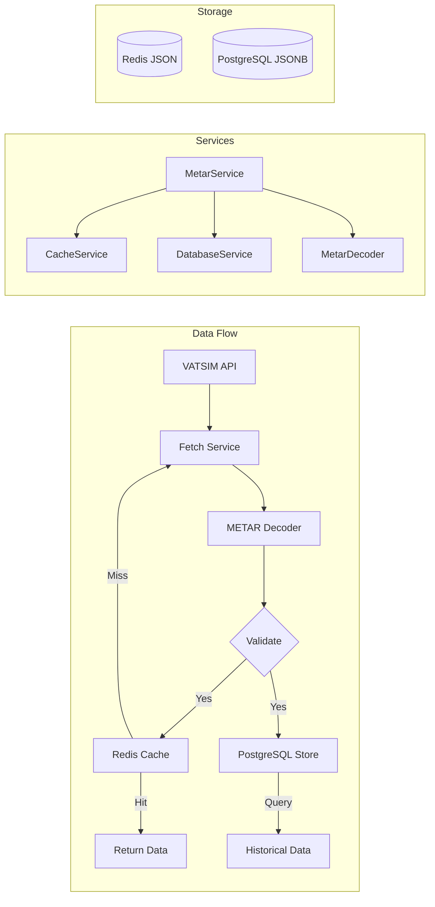
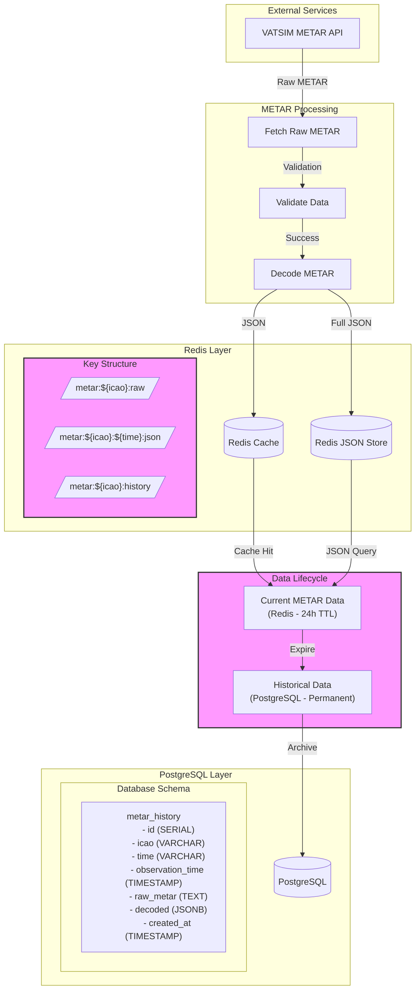

# METAR Processing System Architecture

## Data Flow Diagram



## Full Data Flow



## System Components

### 1. Data Collection

- VATSIM METAR API polling (every 1 minute)
- Raw METAR validation
- Structured data parsing

### 2. Redis Layer (Short-term Storage)

- **Current Data Storage**
  - Raw METAR caching
  - Full JSON storage of decoded data
  - 24-hour retention policy
- **Key Structure**
  - `metar:${icao}:raw` - Raw METAR string
  - `metar:${icao}:${time}:json` - Full JSON data
  - `metar:${icao}:history` - Recent history (last 24h)

### 3. PostgreSQL Layer (Long-term Storage)

- **Table Structure**
  ```sql
  CREATE TABLE metar_history (
      id SERIAL PRIMARY KEY,
      icao VARCHAR(4) NOT NULL,
      time VARCHAR(7) NOT NULL,
      observation_time TIMESTAMP WITH TIME ZONE NOT NULL,
      raw_metar TEXT NOT NULL,
      decoded JSONB NOT NULL,
      created_at TIMESTAMP WITH TIME ZONE DEFAULT NOW(),
      CONSTRAINT metar_history_icao_observation_key UNIQUE (icao, observation_time)
  );
  ```
- Indexed for efficient querying
- JSONB for flexible schema evolution

### 4. Data Lifecycle Management

- **Current Data (Redis)**
  - High-speed access
  - Full JSON structure
  - Real-time updates
- **Historical Data (PostgreSQL)**
  - Long-term storage with accurate timestamps
  - Proper handling of day/month rollovers
  - Query capabilities by actual observation time
  - Data analysis support

### 5. Error Handling

- Connection retry logic
- Data validation
- Transaction management
- Comprehensive logging

## Benefits

1. **Performance**: Fast access to current data via Redis
2. **Flexibility**: Schema-less JSON storage for METAR variations
3. **Reliability**: Persistent storage in PostgreSQL
4. **Scalability**: Separate concerns for different data lifecycles
5. **Maintainability**: Clear separation of responsibilities
